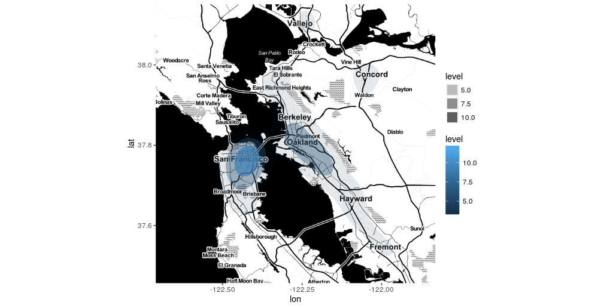

# FARS-traffic

NHTSA US Fatality Analysis Reporting System data for years 2010 through 2015.  



## 1. Clone the repository  
```bash
git clone https://github.com/stoneyv/FARS-traffic.git
```

## 2. Download FARS Data for years 2010 until 2015

NOTE: For the R ggmap scripts there is transformed file named data/fars_acc_10to15.csv  It is not necessary to download the data and run the python notebooks if you just want to work with the R scripts.  If you want to host larger files in your github repositories, read about git large file storage.  It uses the same git work flow and is easy to install.

```bash
cd FARS-traffic
chmod +x download-data-fars.sh
./download-data-fars.sh
``` 

## 3. Transform the data using jupytr ipython notebooks

Install Anaconda Python3  
https://docs.continuum.io/anaconda/install

Many of the necessary python packages for analyzing data are automatically installed.

Install the seaborn plotting package
`conda install seaborn`


## 4. Get the FARS Analytical User's Manual
Fatality Analysis Reporting System (FARS) Analytical User's Manual 1975-2015
*  https://crashstats.nhtsa.dot.gov/#/
*  https://crashstats.nhtsa.dot.gov/Api/Public/ViewPublication/812315


## 5. Optional R ggplot2
Install R language, Rstudio or Rstudio server  
https://www.rstudio.com/products/rstudio/

